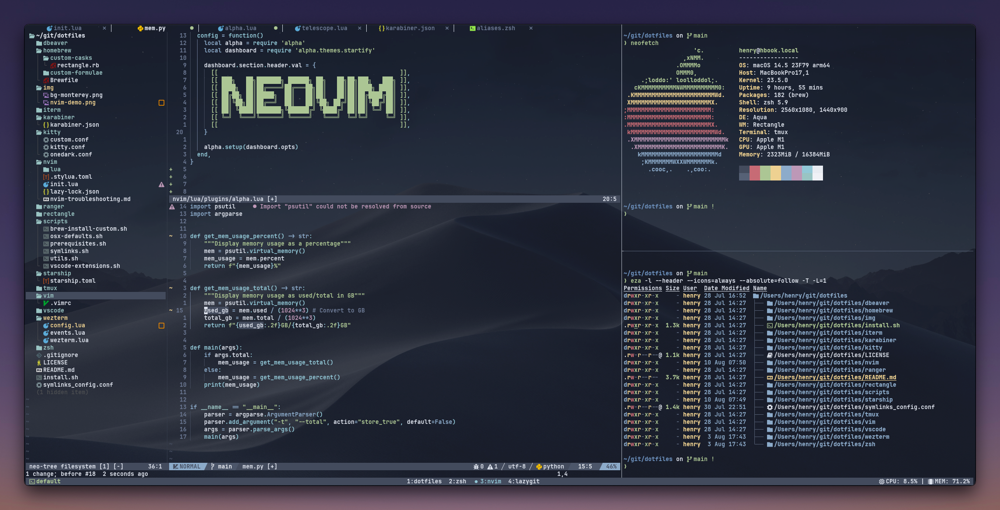

# Dotfiles

My config files for maintaining a consistent dev environment across machines.



## Supported Operating Systems

This repository supports both **macOS** and **Ubuntu** with OS-specific configurations:

- **macOS**: Uses Homebrew for package management, includes macOS-specific apps and system defaults
- **Ubuntu**: Uses apt/snap for packages, includes GNOME settings and Linux-specific configurations

## Essential Tools

- **Editor**: [NeoVim](https://neovim.io/), with a lightweight [Vim](https://www.vim.org/) fallback config (no dependencies) for maximum portability.
- **Multiplexer**: [Tmux](https://github.com/tmux/tmux/wiki)
- **Terminal**:
  - **macOS**: [Ghostty](https://ghostty.org/) (Previously: [WezTerm](https://wezfurlong.org/wezterm/index.html))
  - **Ubuntu**: [WezTerm](https://wezfurlong.org/wezterm/index.html)
- **Shell Prompt**: [Starship](https://starship.rs/)
- **Color Theme**: [Nord](https://www.nordtheme.com/docs/colors-and-palettes) across all tools, switchable via environment variables in `.zshenv`.
- **Window Management**:
  - **macOS**: [Rectangle](https://github.com/rxhanson/Rectangle) + [Karabiner-Elements](https://karabiner-elements.pqrs.org/) for keyboard-driven window resizing and app switching.
  - **Ubuntu**: GNOME Extensions for window management
- **File Manager**: [Yazi](https://yazi-rs.github.io/) (Previously: [Ranger](https://github.com/ranger/ranger))

> [!NOTE]
> This repo also includes configs for tools I no longer actively use (WezTerm, kitty, iTerm, VSCode, Ranger). I keep them around as reference and for easy reactivation — their symlinks and Brewfile entries are simply commented out.

## Setup

### Quick Start

**macOS (default):**
```bash
./install.sh
```

**Ubuntu:**
```bash
./install.sh --os ubuntu
```

### Advanced Options

```bash
# Install for specific OS
./install.sh --os mac      # Explicitly install for macOS
./install.sh --os ubuntu    # Install for Ubuntu

# Show help
./install.sh --help
```

The installer will prompt you for:
1. **Install apps?** - Whether to install system packages (Homebrew on macOS, apt/snap on Ubuntu)
2. **Overwrite existing dotfiles?** - Whether to replace existing configuration files

### What Gets Installed

#### macOS
- **Xcode CLI tools** (prerequisite)
- **Homebrew** package manager
- **Formulae**: neovim, tmux, fzf, ripgrep, starship, yazi, zoxide, lazygit, etc.
- **Casks**: Ghostty, Brave Browser, DBeaver, Docker, Obsidian, VS Code, etc.
- **System defaults**: Trackpad, Finder, Dock, keyboard shortcuts, etc.

#### Ubuntu
- **Build essentials**: build-essential, cmake, curl, wget, git
- **apt packages**: neovim, tmux, fzf, ripgrep, zoxide, lazygit, fonts, etc.
- **snap packages**: Brave Browser, DBeaver, Obsidian, Spotify, VLC, VS Code, Docker
- **Development tools**: nvm, pyenv, Docker (optional)
- **GNOME settings**: Terminal, Nautilus, keyboard shortcuts, etc.

### Manual Setup

If you prefer to install components manually:

**macOS:**
```bash
# Install prerequisites
./scripts/prerequisites-mac.sh

# Install apps
./scripts/brew-install-custom.sh

# Apply system defaults
./scripts/osx-defaults.sh

# Create symlinks
./scripts/symlinks.sh --create --os mac
```

**Ubuntu:**
```bash
# Install prerequisites
./scripts/prerequisites-ubuntu.sh

# Apply GNOME settings
./ubuntu/gsettings.sh

# Create symlinks
./scripts/symlinks.sh --create --os ubuntu
```

## Uninstalling

To remove all symlinks created by the installation script:

**macOS:**
```bash
./scripts/symlinks.sh --delete --os mac
```

**Ubuntu:**
```bash
./scripts/symlinks.sh --delete --os ubuntu
```

This only removes the symlinks, not the actual config files, so you can easily revert if needed.

## File Structure

```
dotfiles/
├── install.sh                  # Main installer with --os argument
├── scripts/
│   ├── utils.sh               # Shared utility functions
│   ├── install-mac.sh         # macOS-specific installation
│   ├── install-ubuntu.sh      # Ubuntu-specific installation
│   ├── prerequisites-mac.sh  # macOS prerequisites (Xcode, Homebrew)
│   ├── prerequisites-ubuntu.sh # Ubuntu prerequisites (build-essential, apt)
│   ├── brew-install-custom.sh # Homebrew custom formulae/casks
│   ├── osx-defaults.sh        # macOS system defaults
│   └── symlinks.sh            # Symlink manager (supports OS markers)
├── ubuntu/
│   ├── packages.txt           # apt packages list
│   ├── snaps.txt              # snap packages list
│   └── gsettings.sh           # GNOME settings
├── homebrew/
│   └── Brewfile               # Homebrew bundle for macOS
├── symlinks.conf              # Symlink configurations (with OS markers)
├── zsh/
│   ├── .zshrc                 # Main zsh config (OS-agnostic)
│   ├── .zshenv                # Environment variables
│   ├── custom-mac.zsh         # macOS-specific zsh settings
│   ├── custom-ubuntu.zsh      # Ubuntu-specific zsh settings
│   └── aliases.zsh            # Shell aliases
├── nvim/                      # NeoVim configuration
├── tmux/                      # Tmux configuration
├── yazi/                      # Yazi file manager
├── starship/                  # Starship prompt
├── ghostty/                   # Ghostty terminal (macOS)
├── wezterm/                   # WezTerm terminal (Ubuntu/macOS)
├── vscode/                    # VS Code settings
├── karabiner/                 # Karabiner-Elements config (macOS)
├── rectangle/                 # Rectangle config (macOS)
└── ...                        # Other tool configurations
```

## OS-Specific Configurations

### Symlinks Configuration

The `symlinks.conf` file supports OS markers to distinguish between macOS and Ubuntu configurations:

```
# Shared (both OS)
$(pwd)/zsh/.zshrc:$HOME/.zshrc

# macOS-specific (ends with :mac)
$(pwd)/ghostty:$HOME/.config/ghostty:mac

# Ubuntu-specific (ends with :ubuntu)
$(pwd)/wezterm:$HOME/.config/wezterm:ubuntu
```

### Shell Configuration

- **` .zshrc`**: Main entry point (OS-agnostic)
- **`custom-mac.zsh`**: macOS-specific settings (Homebrew paths, Ghostty, etc.)
- **`custom-ubuntu.zsh`**: Ubuntu-specific settings (apt paths, WezTerm, etc.)

The appropriate `custom-*.zsh` file is symlinked as `custom.zsh` based on the OS.

## Adding New Dotfiles and Software

### Dotfiles

1. Place the config file in the appropriate directory within this repo.
2. Add a symlink entry in `symlinks.conf` with OS marker if needed:
   ```
   $(pwd)/config-file:$HOME/.config/file        # Shared
   $(pwd)/mac-config:$HOME/.config/app:mac      # macOS only
   $(pwd)/linux-config:$HOME/.config/app:ubuntu # Ubuntu only
   ```
3. If needed, update `install.sh` or OS-specific scripts to handle additional setup.

### Software Installation

**macOS:**
Software is managed via Homebrew. To add a formula or cask:
1. Update `homebrew/Brewfile`
2. Run `./scripts/brew-install-custom.sh`

**Ubuntu:**
- For **apt packages**: Add to `ubuntu/packages.txt`
- For **snap packages**: Add to `ubuntu/snaps.txt`
- For manual package installation: Update `scripts/prerequisites-ubuntu.sh`

### macOS Window Management

I find macOS window management extremely frustrating: Repeatedly pressing Cmd+Tab to switch apps or having to reach for the mouse to click and drag. It's painfully slow and breaks my flow. To streamline my workflow, I built a custom setup using [Karabiner-Elements](https://karabiner-elements.pqrs.org/) and [Rectangle](https://rectangleapp.com/). Together, they let me manage windows and switch apps with minimal mental overhead, at maximum speed, entirely from the keyboard. Here's how it works:

The `Tab` key acts as a regular `Tab` when tapped, but when held it becomes a modifier (hyperkey) that unlocks two layers:

- **Window layer** (`Tab + W + ...`): Resize and position windows via Rectangle. E.g. `Tab + W + H` for left half, `Tab + W + L` for right half.
- **Expose layer** (`Tab + E + ...`): Jump directly to a specific app. E.g. `Tab + E + J` for browser, `Tab + E + K` for terminal.

## Troubleshooting

### Symlinks Not Found

If symlinks are pointing to non-existent files, ensure you're in the dotfiles repository root:

```bash
cd /path/to/dotfiles
./scripts/symlinks.sh --create --os <mac|ubuntu>
```

### Wrong OS Configuration

If the wrong configuration was installed, delete and reinstall:

```bash
# Delete existing symlinks
./scripts/symlinks.sh --delete --os <wrong-os>

# Create correct symlinks
./scripts/symlinks.sh --create --os <correct-os>
```

### Ubuntu: Permission Denied

If you encounter permission errors on Ubuntu, ensure your user is in the necessary groups:

```bash
# Add user to docker group
sudo usermod -aG docker $USER

# Log out and log back in for changes to take effect
```

## Contributing

Feel free to open issues or submit pull requests if you find improvements or bugs.

## License

This project is licensed under the MIT License - see the [LICENSE](LICENSE) file for details.