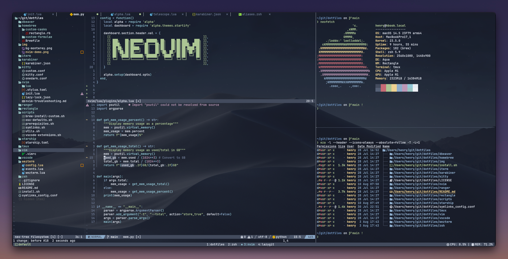

# Dotfiles

My config files for maintaining a consistent dev environment across machines.



## Supported Operating Systems

This repository supports **macOS**, **Ubuntu**, and **Windows** with OS-specific configurations:

- **macOS**: Uses Homebrew for package management, includes macOS-specific apps and system defaults
- **Ubuntu**: Uses apt/snap for packages, includes GNOME settings and Linux-specific configurations
- **Windows**: PowerShell helper (`win-make-symlink.ps1`) for creating individual symlinks into `$HOME`. The full `install.sh` / `symlinks.sh` flow is macOS/Ubuntu only.

## Essential Tools

- **Editor**: [NeoVim](https://neovim.io/), with a lightweight [Vim](https://www.vim.org/) fallback config (no dependencies) for maximum portability.
- **Multiplexer**: [Tmux](https://github.com/tmux/tmux/wiki)
- **Terminal**:
  - **macOS**: [Ghostty](https://ghostty.org/) (Previously: [WezTerm](https://wezfurlong.org/wezterm/index.html))
  - **Ubuntu**: [WezTerm](https://wezfurlong.org/wezterm/index.html)
- **Shell Prompt**: [Starship](https://starship.rs/)
- **Color Theme**: [Nord](https://www.nordtheme.com/docs/colors-and-palettes) across all tools, switchable via environment variables in `.zshenv`.
- **Window Management**:
  - **macOS**: [Rectangle](https://github.com/rxhanson/Rectangle) + [Karabiner-Elements](https://karabiner-elements.pqrs.org/) for keyboard-driven window resizing and app switching.
  - **Ubuntu**: GNOME Extensions for window management
- **File Manager**: [Yazi](https://yazi-rs.github.io/) (Previously: [Ranger](https://github.com/ranger/ranger))

> [!NOTE]
> This repo also includes configs for tools I no longer actively use (WezTerm, kitty, iTerm, VSCode, Ranger). I keep them around as reference and for easy reactivation — their symlinks and Brewfile entries are simply commented out.

## OpenCode AI Assistant

This repo also includes a fully configured [OpenCode](https://opencode.ai/) AI assistant setup with specialized agents, custom commands, and automation skills.

### Overview

OpenCode is configured in `opencode/opencode.json` to use `opencode/kimi-k2.6` model with `autoupdate: true`.

### Agents

21 specialized agents for different domains:

| Category | Agents |
|----------|--------|
| **General Development** | `architect-designer`, `implementation-specialist`, `tech-lead`, `requirements-clarifier`, `test-automation-engineer` |
| **Task Decomposition** | `big-pickle-simple-tasks` |
| **Data Science / ML / MLOps** | `data-pipeline-engineer`, `ml-model-trainer`, `mlops-deployment-engineer`, `deep-learning-specialist`, `data-analyst-storyteller`, `feature-engineer`, `experiment-tracker`, `data-quality-guardian`, `vector-db-specialist`, `data-governance-officer` |
| **Mobile Development** | `mobile-ui-specialist`, `native-module-bridge`, `mobile-performance-tuner`, `mobile-state-architect`, `mobile-release-engineer` |

Each agent follows a consistent structure with front matter defining `description`, `mode` (primary/subagent), and `tools` restrictions.

### Commands

Custom slash commands available in OpenCode:

- **`/build`** - Builds the project (delegates to `build` agent)
- **`/scan`** - Scans for vulnerabilities using Snyk MCP

### Skills

**`ship` skill** — Full CI/CD workflow that commits staged changes, pushes the branch, opens a PR, and triggers an automated opencode review.

### TUI Keybindings

Custom keybindings with `ctrl+o` as the leader:
- `<leader>e` - Editor open
- `<leader>b` - Sidebar toggle
- `<leader>a` - Agent list
- `<leader>m` - Model list
- `<leader>s` - Status view
- `ctrl+p` - Command list

### Usage

The opencode config is symlinked to `~/.config/opencode` via `symlinks.conf`. All agents, commands, and skills are automatically available when using OpenCode.

On Windows, use `win-make-symlink.ps1` (see [Windows symlink script](#windows-symlink-script)) as a PowerShell equivalent of the bash `symlinks.sh` flow — its default links the opencode config to `~/.config/opencode`, mirroring the macOS/Ubuntu `symlinks.conf` entry.

## Setup

### Quick Start

**macOS (default):**
```bash
./install.sh
```

**Ubuntu:**
```bash
./install.sh --os ubuntu
```

**Windows (PowerShell):**
The repo ships a `win-make-symlink.ps1` helper as a PowerShell equivalent of the bash `symlinks.sh` flow. Run it from a PowerShell prompt at the repo root:

```powershell
# Use the default: link the opencode config to $HOME\.config\opencode
.\win-make-symlink.ps1

# Or link any source to any target
.\win-make-symlink.ps1 -Source ".\nvim" -Target "$HOME\.config\nvim"

# Remove a previously created symlink
.\win-make-symlink.ps1 -Delete
```

The default mirrors the `symlinks.conf:12` entry for macOS/Ubuntu, so the full OpenCode config — agents, commands, skills, plus `opencode.json`/`opencode.jsonc` — becomes available at the standard config location. See the [Windows symlink script](#windows-symlink-script) section below for full details.

### Advanced Options

```bash
# Install for specific OS
./install.sh --os mac      # Explicitly install for macOS
./install.sh --os ubuntu    # Install for Ubuntu

# Show help
./install.sh --help
```

The installer will prompt you for:
1. **Install apps?** - Whether to install system packages (Homebrew on macOS, apt/snap on Ubuntu)
2. **Overwrite existing dotfiles?** - Whether to replace existing configuration files

### What Gets Installed

#### macOS
- **Xcode CLI tools** (prerequisite)
- **Homebrew** package manager
- **Formulae**: neovim, tmux, fzf, ripgrep, starship, yazi, zoxide, lazygit, etc.
- **Casks**: Ghostty, Brave Browser, DBeaver, Docker, Obsidian, VS Code, etc.
- **System defaults**: Trackpad, Finder, Dock, keyboard shortcuts, etc.

#### Ubuntu
- **Build essentials**: build-essential, cmake, curl, wget, git
- **apt packages**: neovim, tmux, fzf, ripgrep, zoxide, lazygit, fonts, etc.
- **snap packages**: Brave Browser, DBeaver, Obsidian, Spotify, VLC, VS Code, Docker
- **Development tools**: nvm, pyenv, Docker (optional)
- **GNOME settings**: Terminal, Nautilus, keyboard shortcuts, etc.

### Manual Setup

If you prefer to install components manually:

**macOS:**
```bash
# Install prerequisites
./scripts/prerequisites-mac.sh

# Install apps
./scripts/brew-install-custom.sh

# Apply system defaults
./scripts/osx-defaults.sh

# Create symlinks
./scripts/symlinks.sh --create --os mac
```

**Ubuntu:**
```bash
# Install prerequisites
./scripts/prerequisites-ubuntu.sh

# Apply GNOME settings
./ubuntu/gsettings.sh

# Create symlinks
./scripts/symlinks.sh --create --os ubuntu
```

## Uninstalling

To remove all symlinks created by the installation script:

**macOS:**
```bash
./scripts/symlinks.sh --delete --os mac
```

**Ubuntu:**
```bash
./scripts/symlinks.sh --delete --os ubuntu
```

This only removes the symlinks, not the actual config files, so you can easily revert if needed.

**Windows:**
```powershell
.\win-make-symlink.ps1 -Delete
```

`-Delete` only touches reparse points (symlinks/junctions) and refuses to remove real files or directories. Move those manually first if you want them gone.

## File Structure

```
dotfiles/
├── install.sh                  # Main installer with --os argument
├── win-make-symlink.ps1        # Windows PowerShell symlink helper (see below)
├── scripts/
│   ├── utils.sh               # Shared utility functions
│   ├── install-mac.sh         # macOS-specific installation
│   ├── install-ubuntu.sh      # Ubuntu-specific installation
│   ├── prerequisites-mac.sh  # macOS prerequisites (Xcode, Homebrew)
│   ├── prerequisites-ubuntu.sh # Ubuntu prerequisites (build-essential, apt)
│   ├── brew-install-custom.sh # Homebrew custom formulae/casks
│   ├── osx-defaults.sh        # macOS system defaults
│   └── symlinks.sh            # Symlink manager (supports OS markers)
├── opencode/
│   ├── opencode.json          # OpenCode config (model, autoupdate)
│   ├── tui.json               # TUI keybindings
│   ├── agents/               # 21 specialized AI agents
│   ├── commands/              # Custom slash commands (build, scan)
│   └── skills/                # Automation skills (ship)
├── ubuntu/
│   ├── packages.txt           # apt packages list
│   ├── snaps.txt              # snap packages list
│   └── gsettings.sh           # GNOME settings
├── homebrew/
│   └── Brewfile               # Homebrew bundle for macOS
├── symlinks.conf              # Symlink configurations (with OS markers)
├── zsh/
│   ├── .zshrc                 # Main zsh config (OS-agnostic)
│   ├── .zshenv                # Environment variables
│   ├── custom-mac.zsh         # macOS-specific zsh settings
│   ├── custom-ubuntu.zsh      # Ubuntu-specific zsh settings
│   └── aliases.zsh            # Shell aliases
├── nvim/                      # NeoVim configuration
├── tmux/                      # Tmux configuration
├── yazi/                      # Yazi file manager
├── starship/                  # Starship prompt
├── ghostty/                   # Ghostty terminal (macOS)
├── wezterm/                   # WezTerm terminal (Ubuntu/macOS)
├── vscode/                    # VS Code settings
├── karabiner/                 # Karabiner-Elements config (macOS)
├── rectangle/                 # Rectangle config (macOS)
└── ...                        # Other tool configurations
```

## OS-Specific Configurations

### Windows symlink script

`win-make-symlink.ps1` is a small PowerShell wrapper around `New-Item -ItemType SymbolicLink` for one-off symlinks on Windows. It is the PowerShell equivalent of the bash `scripts/symlinks.sh` for users who can't run the bash installer (e.g. native Windows PowerShell without WSL or Git Bash). The default mirrors the `symlinks.conf:12` opencode entry, but `-Source` and `-Target` accept any path for ad-hoc links.

**Default behaviour:** when invoked with no arguments, the script links the whole `.\opencode` directory (relative to the script) to `$HOME\.config\opencode`. This mirrors the `symlinks.conf:12` entry `$(pwd)/opencode:$HOME/.config` that the macOS/Ubuntu installers apply, and makes the full OpenCode config available at the standard location: agents, commands, skills, plus `opencode.json` / `opencode.jsonc`. On a successful run the slash-commands in `opencode/commands/build.md`, `commit.md`, `review.md`, and `scan.md` are immediately available as `/build`, `/commit`, `/review`, and `/scan` in OpenCode.

**Usage:**

```powershell
# Use defaults (whole opencode config -> $HOME\.config\opencode)
.\win-make-symlink.ps1

# Explicit source and target
.\win-make-symlink.ps1 -Source ".\nvim" -Target "$HOME\.config\nvim"

# Remove a symlink
.\win-make-symlink.ps1 -Delete

# Remove a symlink at a non-default location
.\win-make-symlink.ps1 -Target "$HOME\.config\nvim" -Delete
```

**Parameters:**

| Parameter | Type | Default | Description |
|-----------|------|---------|-------------|
| `-Source` | string | `<repo>\opencode` | Existing file/folder the link points to. |
| `-Target` | string | `$HOME\.config\opencode` | Path of the link to create. |
| `-Delete` | switch | off | Remove the reparse point at `-Target` instead of creating one. |

**Safety behaviour:**

- Refuses to create a symlink if `-Target` already exists (including a regular directory or file). Move or delete it first.
- `-Delete` only removes reparse points (symlinks or junctions). It errors out on real files/dirs so you cannot accidentally nuke content with the wrong flag.
- Missing parent directories under `-Target` are created automatically.
- Creates symbolic links, not junctions, so the same script semantics apply whether the target is a file or a folder.

**Prerequisites (Windows-only):** The script self-elevates. When launched from a non-administrator session, it re-launches itself with `Start-Process -Verb RunAs`, which triggers the standard UAC prompt. Click *Yes* to allow elevation, and the elevated instance does the work in a new PowerShell window and **stays open after the script finishes** (via `powershell.exe -NoExit`) so the output is readable. Click *No* and the script exits without making changes. The script must be invoked as a file (e.g. `.\win-make-symlink.ps1`); piping or `-Command` invocations cannot self-elevate. The UAC prompt is shown even if Developer Mode is enabled — the script does not probe for Dev Mode.

**Unelevated-user path guarantee:** The script resolves `-Source` and `-Target` to absolute paths in the unelevated scope and passes them explicitly to the elevated child, so the symlink is always created in the *invoking user's* profile, not whatever `$HOME` the elevated process happens to see. (Under UAC, an elevated process can see a different `$HOME` than the unelevated session, e.g. `C:\Users\Administrator` if elevation is into a different account — without this guarantee, the symlink would land in the wrong profile.)

**Why not just use `symlinks.conf`?** `symlinks.conf` is consumed by `scripts/symlinks.sh`, which is bash-only and not portable to native Windows PowerShell. The helper exists so Windows users get the same one-shot symlink behaviour without needing WSL or Git Bash to run the bash installer. Its default mirrors the `symlinks.conf:12` opencode entry, but you can point `-Source` / `-Target` at any other path for ad-hoc links.

### Symlinks Configuration

The `symlinks.conf` file supports OS markers to distinguish between macOS and Ubuntu configurations:

```
# Shared (both OS)
$(pwd)/zsh/.zshrc:$HOME/.zshrc

# macOS-specific (ends with :mac)
$(pwd)/ghostty:$HOME/.config/ghostty:mac

# Ubuntu-specific (ends with :ubuntu)
$(pwd)/wezterm:$HOME/.config/wezterm:ubuntu
```

### Shell Configuration

- **` .zshrc`**: Main entry point (OS-agnostic)
- **`custom-mac.zsh`**: macOS-specific settings (Homebrew paths, Ghostty, etc.)
- **`custom-ubuntu.zsh`**: Ubuntu-specific settings (apt paths, WezTerm, etc.)

The appropriate `custom-*.zsh` file is symlinked as `custom.zsh` based on the OS.

## Adding New Dotfiles and Software

### Dotfiles

1. Place the config file in the appropriate directory within this repo.
2. Add a symlink entry in `symlinks.conf` with OS marker if needed:
   ```
   $(pwd)/config-file:$HOME/.config/file        # Shared
   $(pwd)/mac-config:$HOME/.config/app:mac      # macOS only
   $(pwd)/linux-config:$HOME/.config/app:ubuntu # Ubuntu only
   ```
3. If needed, update `install.sh` or OS-specific scripts to handle additional setup.

### Software Installation

**macOS:**
Software is managed via Homebrew. To add a formula or cask:
1. Update `homebrew/Brewfile`
2. Run `./scripts/brew-install-custom.sh`

**Ubuntu:**
- For **apt packages**: Add to `ubuntu/packages.txt`
- For **snap packages**: Add to `ubuntu/snaps.txt`
- For manual package installation: Update `scripts/prerequisites-ubuntu.sh`

### macOS Window Management

I find macOS window management extremely frustrating: Repeatedly pressing Cmd+Tab to switch apps or having to reach for the mouse to click and drag. It's painfully slow and breaks my flow. To streamline my workflow, I built a custom setup using [Karabiner-Elements](https://karabiner-elements.pqrs.org/) and [Rectangle](https://rectangleapp.com/). Together, they let me manage windows and switch apps with minimal mental overhead, at maximum speed, entirely from the keyboard. Here's how it works:

The `Tab` key acts as a regular `Tab` when tapped, but when held it becomes a modifier (hyperkey) that unlocks two layers:

- **Window layer** (`Tab + W + ...`): Resize and position windows via Rectangle. E.g. `Tab + W + H` for left half, `Tab + W + L` for right half.
- **Expose layer** (`Tab + E + ...`): Jump directly to a specific app. E.g. `Tab + E + J` for browser, `Tab + E + K` for terminal.

## Troubleshooting

### Symlinks Not Found

If symlinks are pointing to non-existent files, ensure you're in the dotfiles repository root:

```bash
cd /path/to/dotfiles
./scripts/symlinks.sh --create --os <mac|ubuntu>
```

### Wrong OS Configuration

If the wrong configuration was installed, delete and reinstall:

```bash
# Delete existing symlinks
./scripts/symlinks.sh --delete --os <wrong-os>

# Create correct symlinks
./scripts/symlinks.sh --create --os <correct-os>
```

### Ubuntu: Permission Denied

If you encounter permission errors on Ubuntu, ensure your user is in the necessary groups:

```bash
# Add user to docker group
sudo usermod -aG docker $USER

# Log out and log back in for changes to take effect
```

### Windows: UAC prompt was declined

`win-make-symlink.ps1` self-elevates on launch via `Start-Process -Verb RunAs`, so the very first run pops a UAC dialog. If you click *No*, the script exits without changes. Re-run from a normal PowerShell and click *Yes* on the prompt, **or** invoke the script from an already-elevated session (right-click *Terminal* / *PowerShell* > *Run as administrator*) to skip the prompt.

If you launched from `-Command` or via `iex`, the script prints a "Cannot self-elevate" error instead. Always invoke it as a file:

```powershell
.\win-make-symlink.ps1
```

If `-Target` is a real directory (not a symlink), `-Delete` will refuse to remove it. Verify with:

```powershell
Get-Item $HOME\.config\opencode -Force | Select-Object Attributes, LinkType
```

`LinkType` should report `SymbolicLink` after a successful create; an empty `LinkType` means it's a regular directory, so back it up with `Move-Item` before re-running the create.

## Contributing

Feel free to open issues or submit pull requests if you find improvements or bugs.

## License

This project is licensed under the MIT License - see the [LICENSE](LICENSE) file for details.